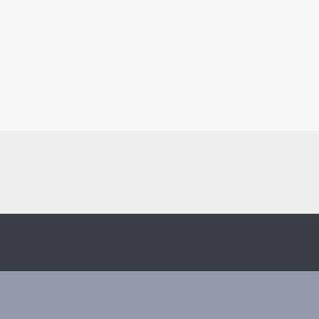

# Standards

Kindly abide by the following standards before pushing new changes, this is extremely important to keep good the whole website experience consistent across all pages and easier to improve in later stages.

## Colors

Background: #F7F7F7   
Secondary background: #EEEEEE   
Elements Primary: #393E46   
Elements Secondary: #929AAB   

## Typography

Font-Family: bootstrap native stack, for optimum text rendering on every device and OS.   
Headings: H1, H2, H3   
Elements Border-radius: 6px   
Paragraph Font size: 16px / 20px for the blogs   
Icons: Bootstrap icons   

## Naming Conventions 
Pages/ OOP classes/ Git Branches: PascalCase   
Variables/ Functions: camelCase   
CSS classes: bootstrap style, lower case words separated by hyphen "variable-test"   
